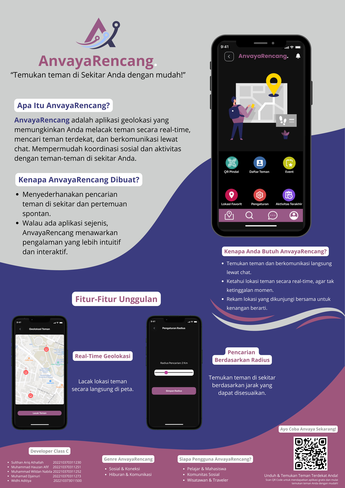
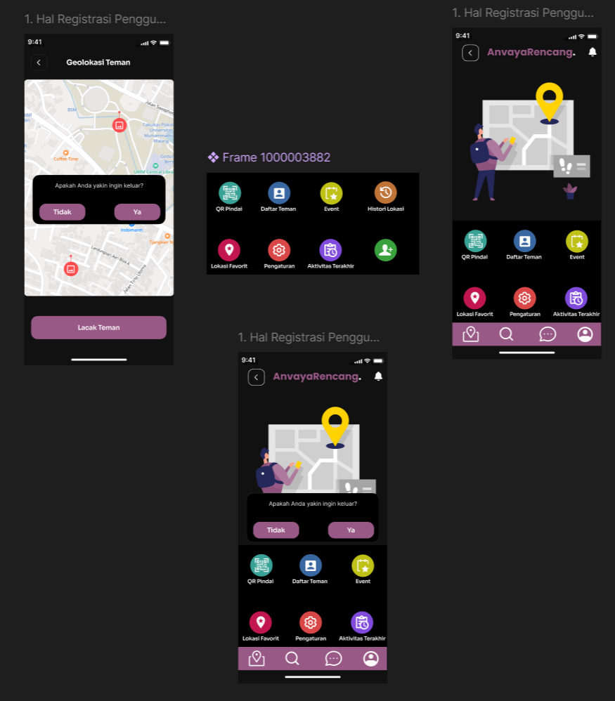
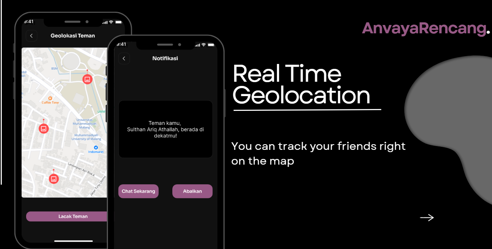
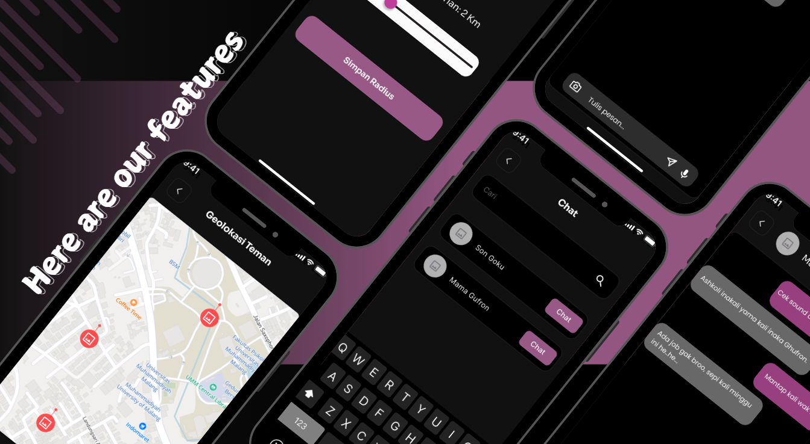
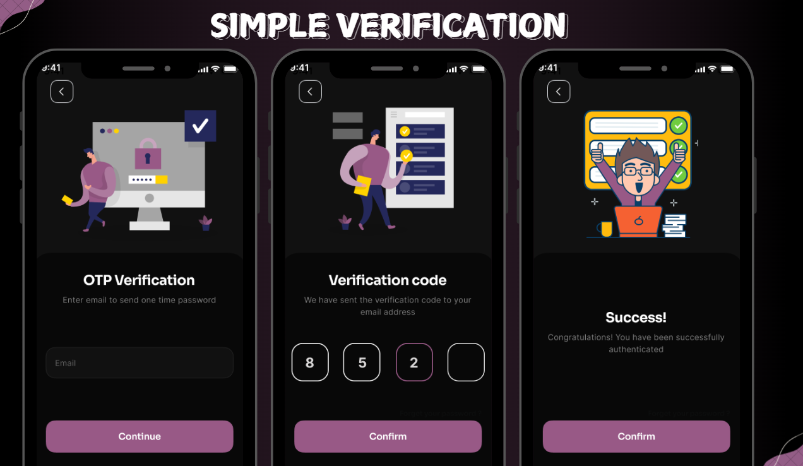

# 📍 AnvayaRencang — Social Geolocation Mobile Application

---

## 🔵 Academic Project | Mobile Application Development | 2024

AnvayaRencang is a mobile-based social geolocation application developed as part of a **Mobile Application Development course project**.

The application is designed to facilitate real-time interaction between users by integrating **location tracking**, **social communication**, and **mobile interface design** into a unified system.

---

## 🧠 Project Overview

The increasing need for real-time social interaction in mobile environments highlights the importance of integrating **location awareness** with communication features.

This project explores the development of a mobile application that enables users to:

- Track nearby friends using geolocation  
- Communicate through in-app messaging  
- Discover connections based on distance  
- Manage frequently visited locations  

The system is designed to simulate a real-world social application with emphasis on usability, responsiveness, and feature integration.

---

## ⚙️ Key Features

- 📍 Real-Time Geolocation Tracking  
- 💬 In-App Chat System  
- 📡 Radius-Based User Discovery  
- ⭐ Favorite Location Management  
- 🔔 Proximity Notification  
- 🔐 OTP-Based Authentication  

---

## 🧩 Technical Approach

The application is developed using a multi-layered approach:

- Dart for mobile interface and application logic  
- C++ for native-level functionality and performance handling  
- Swift for platform-specific integration (iOS)  
- CMake for build system management  

This combination demonstrates an understanding of both **high-level mobile development** and **low-level system integration**.

---

## 📊 App Preview

### 🖥️ Application Overview

---

### 📱 Main Interface

---

### 📍 Geolocation Feature

---

### 💬 Chat Feature

---

### 🔐 Authentication (OTP)

---

## 🧠 Key Learnings

- Integration of geolocation with social interaction in mobile environments  
- Implementation of multi-language development (Dart, C++, Swift)  
- Understanding mobile UI/UX design principles  
- Managing application flow and user interaction  
- Building modular mobile application structures  

---

## 🎯 Application Scope

- Educational project for mobile system development  
- Simulation of social interaction application  
- Demonstration of mobile UI/UX and system integration  

---

## 🧰 Tech Stack

- Dart (Mobile Development)  
- C++ (Native Module)  
- Swift (iOS Integration)  
- CMake (Build System)  

---

## ⚠️ Limitations

- Prototype-level implementation  
- No production backend system  
- Limited scalability testing  
- Real-time features are simulated  

---

## 🔮 Future Improvements

- Backend integration (Firebase / API)  
- Real-time data synchronization  
- Performance optimization  
- Cross-platform deployment enhancement  

---

## 👨‍💻 Author

| Name | Role |
|------|------|
| **Muhammad Wildan Nabila** | Product Developer / UI/UX Designer |
| Sulthan Ariq Athallah | Mobile System Engineer  |
| Muhammad Hauzan Afif | Mobile Developer |
| Muhammad Diainuri | Backend Support |
| Widhi Aditiya | System Support |

---

## 🚀 Closing

This project represents an academic exploration of mobile application development by integrating geolocation, communication, and user-centered design into a cohesive system.
